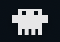
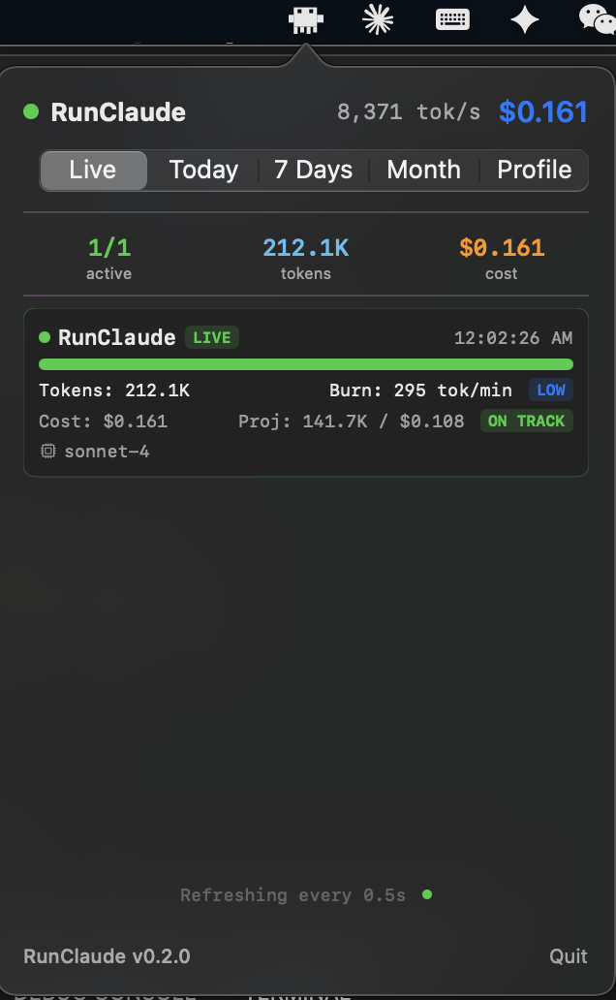
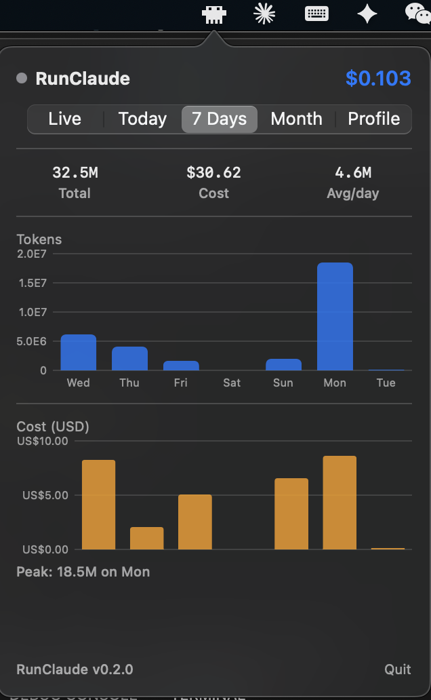
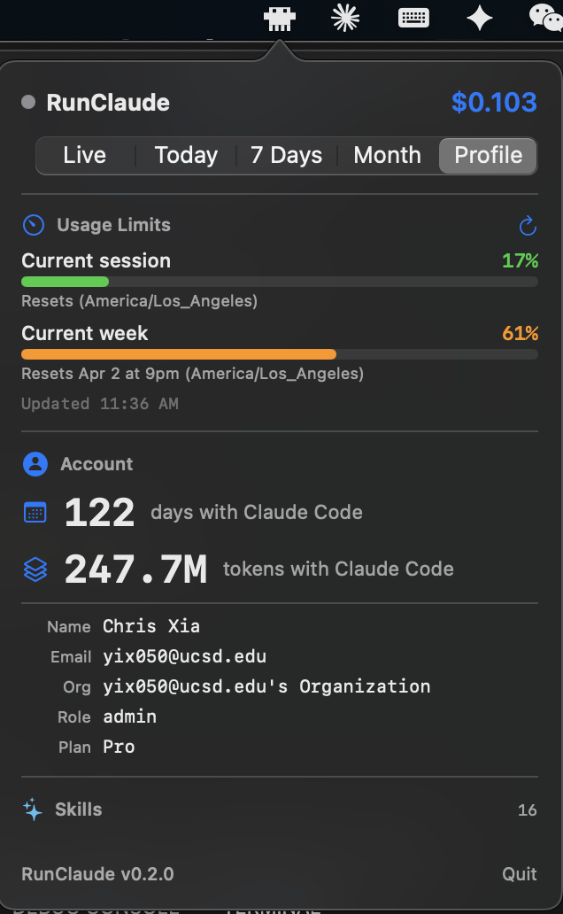

# RunClaude  


A little Clawd that lives in your Mac's menu bar that helps you track your token usage.


<video src="images/RunClaude Demo.mp4" controls width="80%"></video>


---

## How to run

1. Build

```bash
cd RunClaude && ./Scripts/make-app.sh
```

2. Run the app

```bash
open build/RunClaude.app   
```

---

## Screenshots

**Live** — real-time tokens and cost for the active Claude session, refreshing every 0.5 seconds.



**7 Days** — token and cost breakdown over the past week, with daily bar charts.



**Profile** — account summary showing total days, lifetime tokens, and usage limits for the current session and week.




---

Inspired by [ccusage](https://github.com/ryoppippi/ccusage).

---

## Test Token Using

```bash
swift Scripts/generate-test-data.swift --live
```
